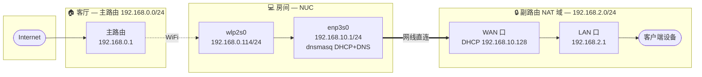
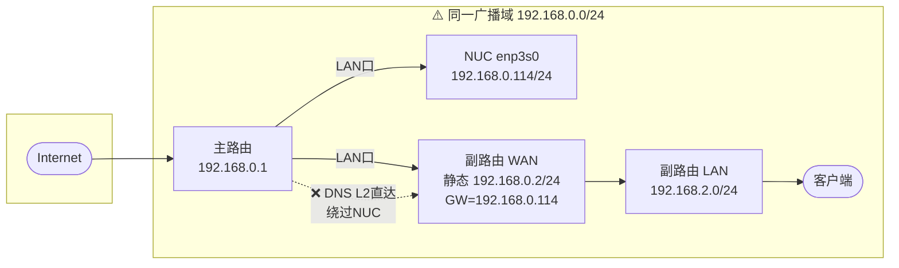
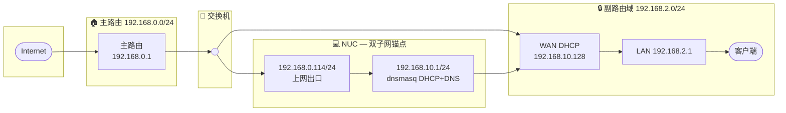
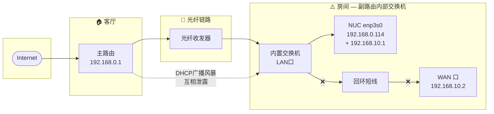
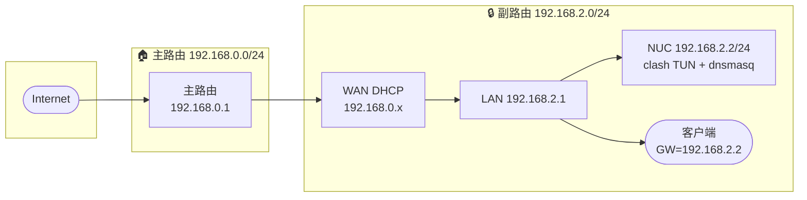
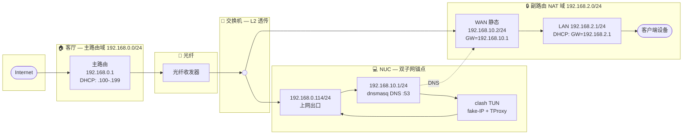
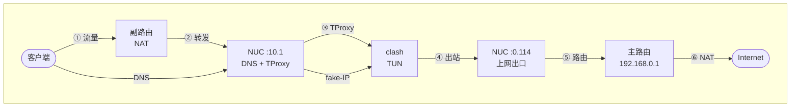

# 光猫桥接

之前在出租屋搞过 理论上握很熟悉这个流程了 但不知道是被封锁了还是什么 家里的光猫没法强制重置 只能到咸鱼花了￥25查到了超级密码

用超级密码登录光猫后台 记录INTERNET连接VLAN ID 删掉连接再新建一个Bridge类型的INTERNET连接 填回VLAN ID就改好桥接了（注意关掉强推等会被运营商覆盖设置的功能）

另一个问题是我不知道宽带密码 在出租屋咋搞的也不记得了 根据经验猜了无数个密码组合都不行

根据网上的教程 先用一个工具开光猫telnet 进去把加密的光猫配置文件导出来 再用另一个工具解密就可以看到明文的配置文件了

> 中兴光猫telnet工具：[https://github.com/douniwan5788/zte\_modem\_tools](https://github.com/douniwan5788/zte_modem_tools)
>
> 备份：[zte\_modem\_tools-main.zip](/upload/zte_modem_tools-main.zip)
>
> 使用方法：`python3 zte_factroymode.py --user CMCCAdmin --pass --ip 192.168.1.1 --port 80 telnet open`
>
> 解密工具：[https://pan.baidu.com/s/1kDfNa7nJ2madFadPlPgnjQ?pwd=y6my](https://pan.baidu.com/s/1kDfNa7nJ2madFadPlPgnjQ?pwd=y6my)
>
> 备份：[光猫破解工具.rar](/upload/%E5%85%89%E7%8C%AB%E7%A0%B4%E8%A7%A3%E5%B7%A5%E5%85%B7.rar)
>
> 使用方法： `./ztecfg.exe db_user_cfg.xml`

之后就可以快乐地用路由器拨号上网了

# 铺设隐形光纤

由于我家在装修时没有预埋网线 导致只能走明线 思考之后决定走隐形光纤 沿着墙缝走线基本看不出来 两头加上光纤收发器就可以当成正常网线来用了（有钱的可以直接用光口交换机/路由器 或者千兆以上的光纤收发器来提升体验）

# NUC软路由

参见上一篇文章 放弃了折腾好几天都没搞成功的ImmortalWrt系统

被同学点醒 可以直接让DeepSeek via Claude Code帮我配环境 加了 `ssh-manager` 的MCP就可以让Claude Code直接操作NUC了

NUC系统装的Debian 13 无线网卡的驱动也是自带的 在AI的指导下也是经历了好几个阶段

## 阶段 1：WiFi 上联 + 网线直连（✅ 可行）

**特征：** WiFi 上联、双子网物理隔离、dnsmasq DHCP+DNS、nftables NAT masquerade。

## 阶段 2：纯有线单子网（❌ 不可行）

**致命缺陷：** 副路由 DNS → 192.168.0.1:53 走交换机 L2 直达，clash 拿不到域名。

## 阶段 3：交换机 + 双子网（⚠️ DHCP 竞态）

**风险：** NUC 和主路由两个 DHCP 同时可达副路由，WAN 口可能拿到 192.168.0.x。

## 阶段 4：LAN 口回环（❌ DHCP 风暴）

**致命缺陷：** 回环线把 WAN 拖入广播域，主副路由 DHCP 双向泄露，网络卡死。

## 阶段 5：NUC 挂副路由下面（⚠️ 双层 NAT）

**缺点：** NUC 对主网不可见（需 DMZ）、副路由故障连带 NUC 断网。

## 阶段 6：交换机 + 双子网 + 静态 IP（★ 最终方案）

**数据流：三条路径**

**路径说明：**
- **①→⑥** 上网流量：客户端 → 副路由 NAT → NUC TProxy → clash 代理 → 主路由 → 公网
- **DNS** 查询（虚线）：副路由 → dnsmasq :53 → clash DNS :1053 → 198.18.0.x (fake-IP)

由于交换机的电口是2.5G的 后续升级只需要加一个2.5G网卡就行了 对于无线设备只更换副路由也很方便（只接了一根网线在WAN口）