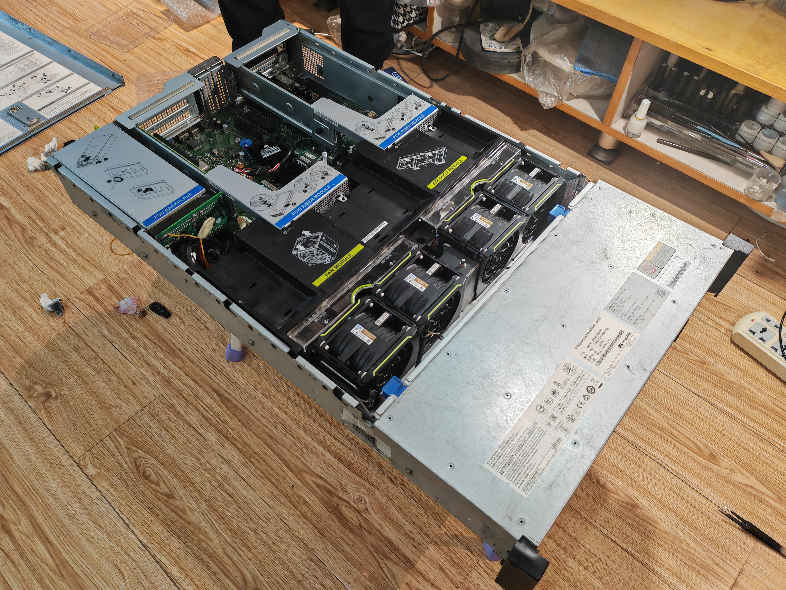
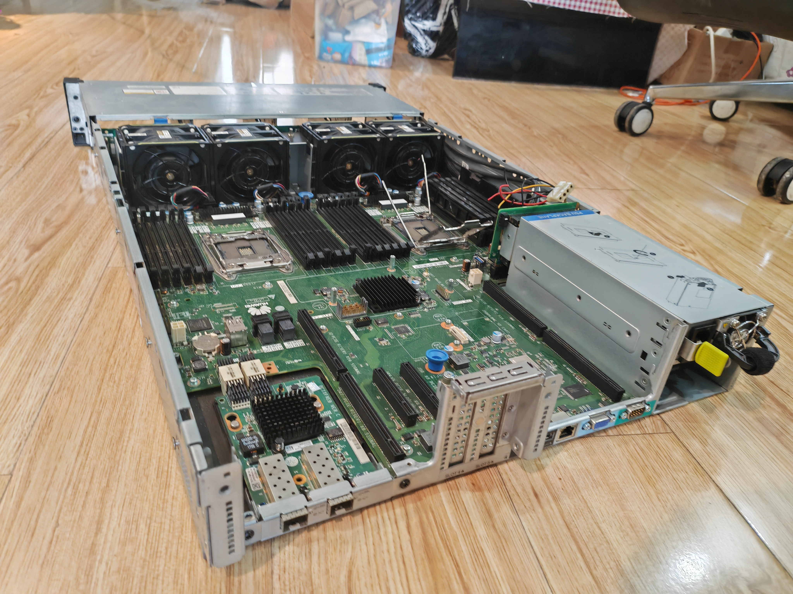
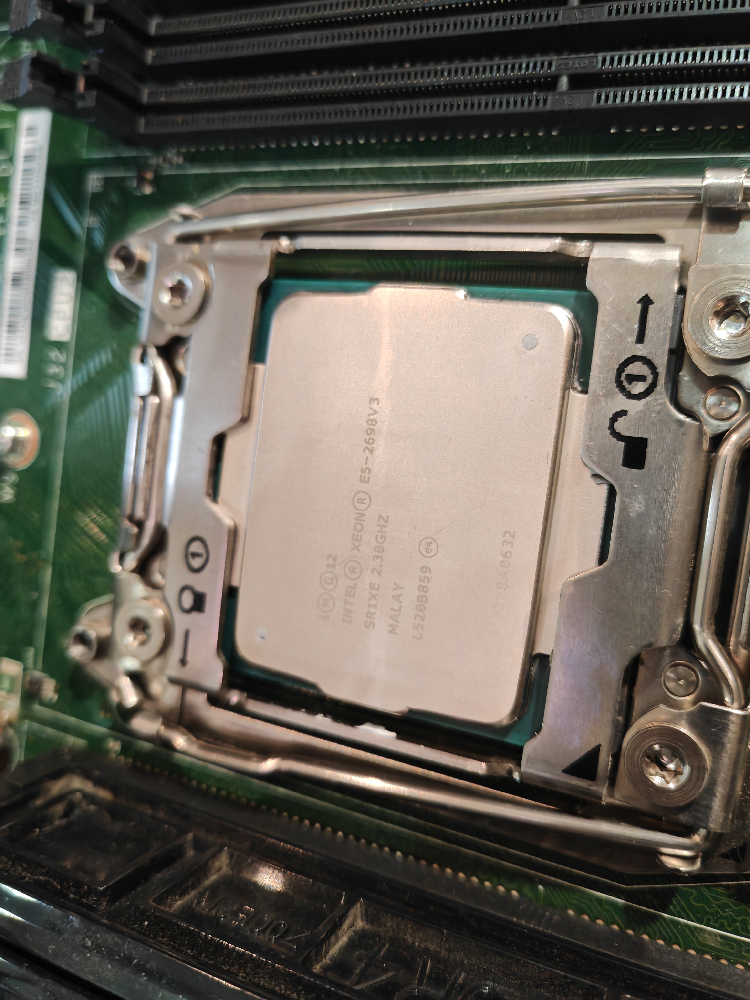
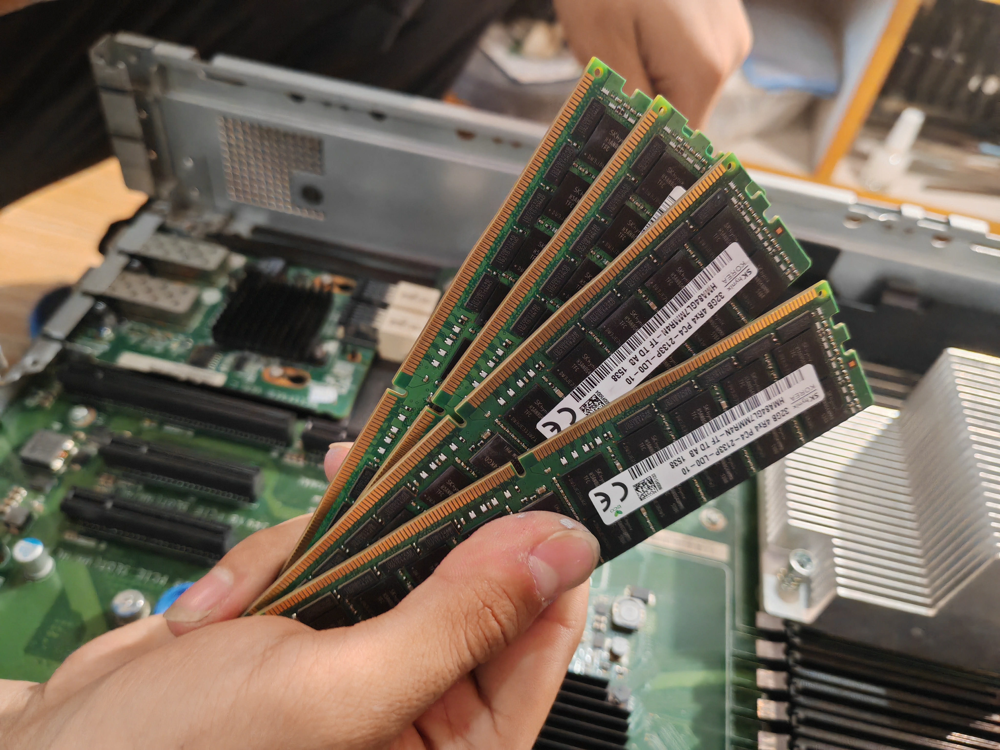
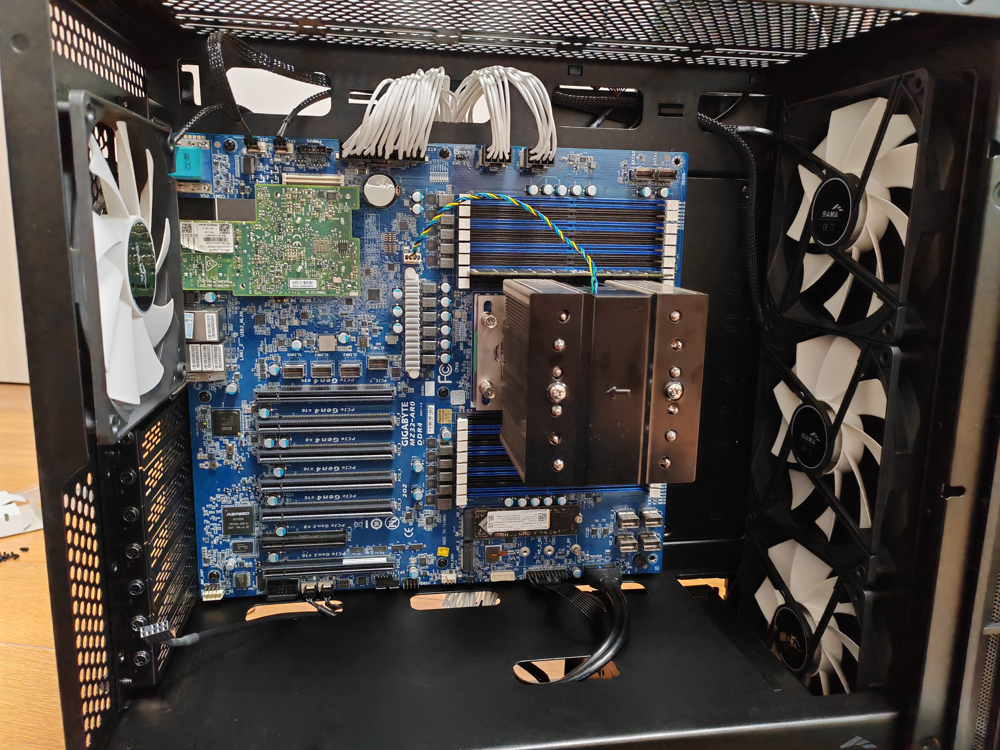
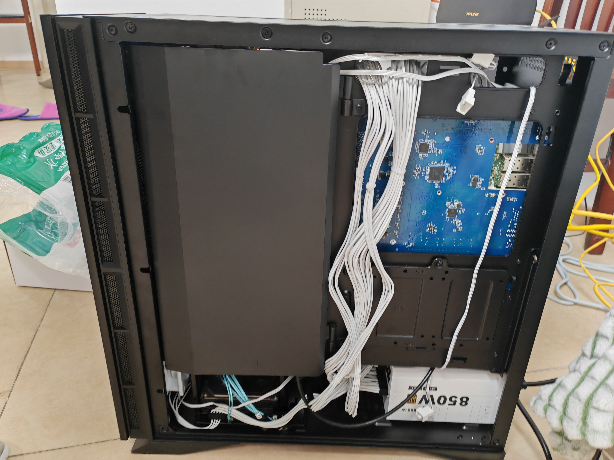
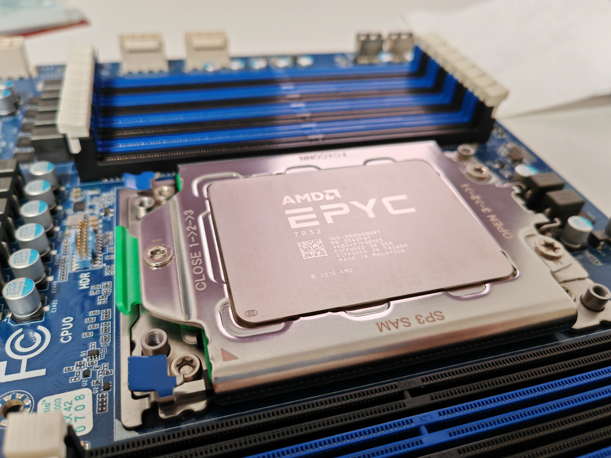

其实很久很久以前就想写这个来着 甚至都写过服务器上配置的一些的东西了 但还是没写过服务器本身
其实以前在自建memos上写过 不过后来那个服务丢了
最近组了一台新的服务器（依旧高位买入 正好被十年之约催更了所以写一下

# 旧服务器

平台是华为RH2288H V3 雷霆大机架式服务器 放在朋友家阁楼上了 ~~（偷吃电费~~

CPU是两颗E5-2698v3 共32核64线程 便宜且框多 为了这碟醋包的饺子

内存是重量级的4*32G SK海力士2133P 24年以150元一条的价格购入 ~~巴菲特来的（~~
二手的服务器电源比较廉价 随便搞了两个功率绝对够用的
后来还加了一块Tesla P100 16G 跑小模型玩玩 还能用来跑转码

最重量级的还是这个硬盘 都是东拼西凑来的 3块500G的机械盘 2块3T机械盘
还有一块240G的固态和一块128G的固态（两个都寄了）
原来系统和主要的虚拟机都在固态上 但寄了一次之后就把宿主ESXi装到500G的机械上了
一块3T的用来做TrueNAS的仓储盘 后来又加了另一块还没用上
哦对了 之前主板还寄过一次 好像是因为梅雨天开着窗户太潮湿了

前两天因为停电手动关机之后就起不来了 后来借助DeepSeek神力救活了

# 新服务器
算是我第一台自己组装的机器 买各种配件加起来真的好贵 甚至还不如再搞个机架式的了 不过要放身边还是普通机箱方便一点

机箱是先马黑洞X 特别大 几乎50cm*50cm了400块顺丰包邮配4个14cm的风扇 不过做工一般 E-ATX多的两个孔位对不上
风扇也是3Pin的 这主板调不了速 后来100块买了4个利民的4Pin风扇换上了

主板是技嘉MZ32-AR0 本来奔着支持EPYC 7002/7003买的 但这个Rev1好像只支持到7002 反正近期也不会换CPU就不管了
CPU 是一颗EPYC 7R32 一颗就拉爆上面两颗E5的 本来想买经典7K62的 不过6CCD加100块升级到满血8CCD 虽然不知道有啥用
内存先买了一条上面一样的32G来测试 已经到900块了:( 打算从旧服务器上拿几根来用
硬盘这次用了正经M.2 拆机美光3500 1TB
为了安全性 电源买了利民850W的白色全新电源 就算加显卡也肯定够了
利用一下主板上的OCP2.0接口 买了个Mellanox双口25G网卡 正好家里有个带10G光口的交换机 加一根拆机DAC线直接用上了

主板上的雷霆扩展性SlimLine 4i(SFF-8654)接口导致我接一块3T机械还得专门买1转4的线
不过也就是说这块主板可以接8块SATA硬盘 还有4块U.2硬盘和2块M.2硬盘

主板板载一颗AST2500芯片用于带外管理 不过这个默认的WebUI实在太差了于是让AI重新搓了一版

::github{repo="truebigsand/MegaRAC-Next"}